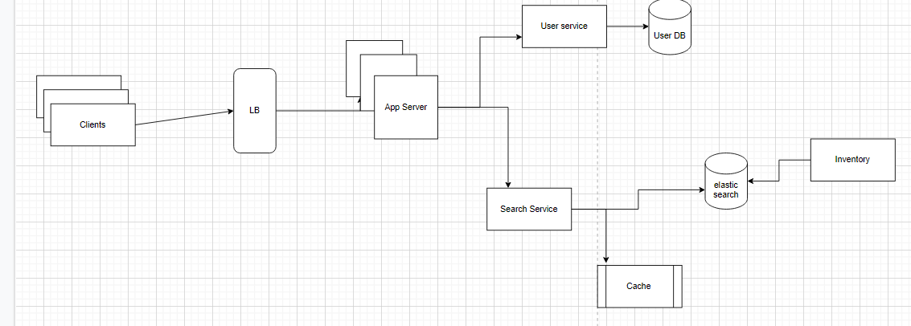

We need to build a solution for car rental.

Problem statement :
1. A city can have an X car rental zone (CRZ) and each CRZ can have multiple cars.
2. Users can select  a particular CRZ  and book a car for rent.
3. User can check for car availability in any CRZ or User search for a car, and system search
   all CRZ where the particular car is available.

